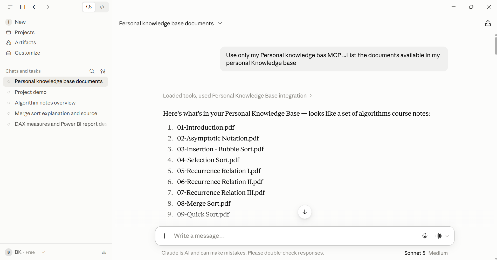

\# Personal Knowledge Base MCP Server


\## Problem


People often have important information stored across multiple documents such as lecture notes, PDFs, assignments, and personal study material. Finding relevant information manually can be time-consuming.


This project provides a personal knowledge base that allows users to upload documents and search their content using semantic similarity rather than relying only on exact keyword matching.


\## Solution


The Personal Knowledge Base MCP Server combines a web application with a Model Context Protocol (MCP) server.


Users can:


\- Create an account and log in securely

\- Upload PDF documents

\- Extract and process document text

\- Split documents into searchable chunks

\- Generate embeddings for document chunks

\- Store embeddings in Qdrant Cloud

\- Search their knowledge base semantically

\- View search history

\- Retrieve document information

\- Connect the knowledge base to Claude Desktop through MCP


Each user's knowledge is isolated using user-specific filtering.


\## Features


\- User registration and login

\- JWT-based authentication

\- PBKDF2 password hashing

\- Multi-user knowledge bases

\- PDF document upload

\- Text extraction

\- Document chunking

\- Semantic vector search

\- Qdrant Cloud integration

\- Similarity threshold filtering

\- Search history

\- Source document and chunk information

\- MCP server integration

\- Claude Desktop compatibility

\- Three MCP tools for knowledge retrieval


\## Architecture


\### Web Application


```text

User

&#x20; ↓

Next.js Frontend

&#x20; ↓

FastAPI Backend

&#x20; ↓

Authentication

&#x20; ↓

Document Processing

&#x20; ↓

Embeddings

&#x20; ↓

Qdrant Cloud

MCP Architecture

Claude Desktop

&#x20;     ↓

&#x20;  MCP Server

&#x20;     ↓

&#x20;  Qdrant

&#x20;     ↓

Personal Knowledge Base

Document Processing Flow

PDF Document

&#x20;    ↓

Text Extraction

&#x20;    ↓

Text Chunking

&#x20;    ↓

Sentence Transformer

&#x20;    ↓

384-dimensional Embedding

&#x20;    ↓

Qdrant Cloud


The project uses the all-MiniLM-L6-v2 sentence-transformer model to generate 384-dimensional embeddings.


Semantic Search Flow

User Question

&#x20;    ↓

Generate Query Embedding

&#x20;    ↓

Qdrant Similarity Search

&#x20;    ↓

User ID Filter

&#x20;    ↓

Similarity Threshold

&#x20;    ↓

Ranked Results

&#x20;    ↓

Source + Chunk + Score


The system uses cosine similarity to compare the query embedding with stored document embeddings.


A similarity threshold of 0.45 is used to filter out results that are not sufficiently relevant.


MCP Tools


The MCP server exposes three tools:


MCP Tool	Purpose

search\_knowledge	Performs semantic search over the user's indexed knowledge

list\_documents	Lists documents available in the knowledge base

get\_document\_context	Retrieves context from a selected document


These tools allow an MCP-compatible AI assistant such as Claude Desktop to interact with the personal knowledge base.


Tech Stack

Frontend

Next.js

React

Tailwind CSS

Backend

Python

FastAPI

SQLite

JWT authentication

PBKDF2 password hashing

AI / Embeddings

Sentence Transformers

all-MiniLM-L6-v2

384-dimensional embeddings

Vector Database

Qdrant Cloud

Cosine similarity

MCP

FastMCP

Model Context Protocol

Project Structure

personal-knowledge-base-mcp/

│

├── backend/

│   ├── ...

│   └── FastAPI application

│

├── frontend/

│   └── Next.js application

│

├── server/

│   └── MCP server

│

├── documents/

│   └── document-related files

│

├── tests/

│   └── project tests

│

├── .gitignore

├── .mcpbignore

├── manifest.json

├── pyproject.toml

├── requirements.txt

├── uv.lock

├── README.md

└── personal-knowledge-base-mcp.mcpb

Setup

1\. Clone the repository

git clone https://github.com/BushraKhan170/BushraKhan\_personal-knowledge-base-mcp.git

cd BushraKhan\_personal-knowledge-base-mcp

2\. Create and activate a virtual environment


On Windows:


python -m venv .venv

.venv\\Scripts\\Activate.ps1

3\. Install backend dependencies

pip install -r requirements.txt

4\. Configure environment variables


Create a .env file locally and configure the required authentication and Qdrant settings.


Do not commit .env to GitHub.


5\. Start the backend

uvicorn backend.main:app --reload

6\. Start the frontend


Open another terminal:


cd frontend

npm install

npm run dev


The frontend and backend URLs depend on the local configuration of the project.


How It Works


After authentication, a user can upload a document through the web application.


The backend extracts the document text and divides it into smaller chunks. Each chunk is converted into a numerical embedding using the sentence-transformer model.


The embeddings are stored in Qdrant Cloud along with document and user information.


When the user submits a question, the question is also converted into an embedding. Qdrant then searches for semantically similar chunks.


The results are filtered by user ID and similarity threshold before being returned to the frontend.


This allows the system to retrieve information based on meaning instead of requiring an exact keyword match.


Multi-User Features


The application supports multiple users.


Each user's documents and search results are associated with their authenticated user ID.


During semantic search, the system applies a user-specific filter so that one user cannot retrieve another user's indexed knowledge through normal application searches.


Authentication uses:


JWT tokens

SQLite for user data

PBKDF2 password hashing

Demo


A typical demo can follow this sequence:


1\. Dashboard


Show the Personal Knowledge Base dashboard and the number of indexed documents.


2\. Semantic Search


Example query:


How does merge sort work?


The system searches the indexed documents and returns semantically relevant chunks together with their similarity scores and source information.


3\. Search History


The application records recent searches so users can review previous queries.


4\. Document Upload


Upload a PDF and demonstrate that it is processed and indexed into the knowledge base.


5\. Claude Desktop


Connect Claude Desktop to the MCP server and demonstrate the available tools:


search\_knowledge

list\_documents

get\_document\_context

6\. MCP Knowledge Retrieval


Example:


Use only my Personal Knowledge Base MCP to answer:

How does merge sort work?


Claude can use the MCP server to search the user's knowledge base.


7\. Relevance Threshold


A question unrelated to the indexed knowledge should not return an unrelated confident result when no sufficiently similar match exists.


For example:


Use only my Personal Knowledge Base MCP:

What is the weather in London today?


The system can return:


No confident match found


when the similarity threshold is not satisfied.


Security


Sensitive configuration files are excluded from version control.


The following should remain local and should not be pushed to GitHub:


.env

backend/users.db

Qdrant API credentials

JWT secrets

Future Improvements

Support for additional document formats

Improved document management

More advanced chunking strategies

Conversation-aware retrieval

Metadata-based filtering

Improved MCP resources and prompts

Additional authentication options

Deployment automation

Automated testing and CI/CD

More detailed analytics for search quality



Author


Bushra Khan

